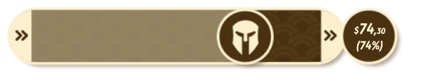

# overlays

OBS Fighting Game Overlays

## Matcherino - Progress

Show a progressbar with the total money raised.



Edit the `matcherino/progress.html` file and replace the `campaign` value with the shortlink name of your event:

```ts
const campaign = "pog97";
```

## Matcherino - Donates

Show an overlay with user donation, avatar and quest type.


Edit the `matcherino/donates.html` file and replace the `campaign` value with the shortlink name of your event:

```ts
const campaign = "pog97";
```

### Collaborators

- [@PaulowebTV](https://twitter.com/PaulowebTV) - **Pauloweb** (streamer)
- [@Ed_Marvin](https://twitter.com/Ed_Marvin) - **MarvinMister** (designer)
